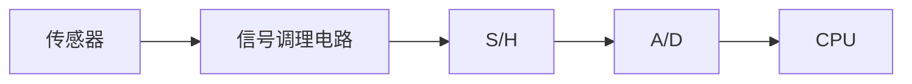

[TOC]

# 采样保持放大器

## 采样保持放大器

### 数据采集系统处理流程

### 采样保持放大器（S/H）的作用

​       在A/D转换过程中。必需保持输入信号不变，才能得到正确的转换结果。当要同时采集多个传感器信号时，需一种电路将各传感器同一时刻的信号保持住，然后通过共用A/D转换器进行转换并送入内存，这种电路就是采样保持器。又简称S/H。
​         在输入逻辑电平控制下出于“采样”或“保持”两种工作状态。“采样”状态下电路的输出跟踪输入模拟信号，在“保持”状态下电路的输出保持前次采样结束时刻的瞬时输入模拟信号，直至进入下一次采样状态为止。

### 数据采集系统

### 采样保持放大器工作电路分析（开环）

采样保持电路是一种具有模拟信号输入、模拟信号输出以及由外部指令控制的模拟门电路。

#### 电路组成

$A_1$——输入缓冲放大器。高输入阻抗，以便与信号源相连；低输出阻抗，以减少捕捉时间。

$A_2$——输出缓冲放大器。高输入阻抗，以减小保持电压下降；低输出阻抗，以便与负载连接。  

$K$——模拟开关。K闭合时，希望R~k~→0，减小捕捉时间。K断开时，希望R~k~→∞，减小保持电压C~H~下降。    

$C_n$——飞渡电容。有些抽样保持器集成在内部，有些需要外接。

#### 工作原理

输入放大器具有高输入阻抗，它对输入信号起缓冲作用，其输出可以作为一个信号源，用来对保持电容充电。输出缓冲器的输入阻抗很高，以使保持电容在保持期间能够保持其电压。当驱动信号为高电平时，模拟开关闭合，电容$C_H$两端的电压跟随模拟输入信号Ui的变化。开关断开时，电容$C_H$上的电压保持不变。

$\mathrm{T_s}$ 为采样周期, $\mathrm{t}_1$ 为采样时间, $\mathrm{t} _2$ 为保持时间 ( $\mathrm{A} / \mathrm{D}$ 转换时间)
$$
T s=t_1+t_2=\frac{1}{f_s}
$$

$$
\begin{aligned}
& U_K=1 \text { 时, K闭合, Ui向 C充电, } \mathrm{Vc}=\mathrm{Vi}(\mathrm{t} 1) \\
& U_K=0 \text { 时, K断开, C保持, } \mathrm{Vo}=\mathrm{V} c=\mathrm{Vi}(\mathrm{t} 1) \\
&
\end{aligned}
$$

####  当K闭合时，C充电，考虑极限情况

$t=0$ 时, $V_i=0 ; t=t 1$ 时, $V_i=V_{i m a x}$
满足充电时间为 $t=\tau \ln \frac{V(\infty)-V(0)}{V(\infty)-V(t)}=R_k C \ln \frac{V_{i \max }-0}{V_{i \max }-\left(V_{i \max }-\Delta\right)}<t_1$
即: $R_k C \ln 2^n<t_1 \quad C<\frac{t_1}{n R_k \ln 2}$

#### K打开时，考虑极限情况

最开始的时候, $V_i=0, V_c=0$; $K$ 打开之后, 即保持时期, $V_i=V i m a x$ 。为了使 $A D$ 转换电路准确采样出信号, 电容两端电压变化不能超过 $\Delta$, 故有

由分压公式
$$
V_c=V_{i \max } \frac{\frac{1}{C}}{\frac{1}{C}+\frac{1}{C_k}}
$$
得
$$
V_c=\frac{V_{i \max } C_k}{C_k+C}<\Delta
$$
即：
$$
C>\left(2^n-1\right) C_k \approx 2^n C_k
$$
综上所述，为满足量化精度，需要保证飞渡电容满足
$$
\left(2^n-1\right) C_k<C<\frac{t_1}{n R_k \ln 2}
$$
综上所述，为满足量化精度，需要保证飞渡电容满足：

所以飞渡电容的选择并不是越大越好或者越小越好，而是需要适当！

注意：有时候电路参数不合适，可能会导致飞渡电容没有取值。

### 采样保持放大器工作电路分析（闭环）

工作原理:
(1)当K1闭合，K2断开时，采样保持器处于跟踪状态，此时飞渡电容CH端电压为：
$$
U_{\mathrm{C}} \approx U_{\mathrm{i}}+e_{\mathrm{OS} 1}-e_{\mathrm{OS} 2}
$$
式中 $e_{O S 1}$ 和 $e_{O S 2}$ 分别为运放 $\mathrm{A} 1, \mathrm{~A} 2$ 的 失调电压。

失调电压：因放大器内部晶体管特性不完全对称，输入为0时输出电压不为0。为了在输出端获得恒定的零电压输出，而需在两个输入端所加的直流电压之差为失调电压。

当K1闭合，K2断开，即在跟踪模式下，两块运放A1和A2共同组成电压跟随器，U0通过反馈电阻R接在A1的反相端，A1对U0和Ui的差值进行放大。当Ui≠U0时，A1的输出迅速对CH充电，提高了充电速度。

当K1断开，K2闭合时，采样保持器处于保持状态，此时飞渡电容端电压保持在K1断开的一瞬间，有：
$$
U_{\mathrm{o}} \approx U_{\mathrm{C}}+e_{\mathrm{OS} 2}=U_{\mathrm{i}}+e_{\mathrm{OS} 1}
$$
在保持状态，K2闭合，放大器A1仍在跟踪输入，避免A1开环而进入饱和，使得采样保持放大器再次进入跟踪状态时，A1能立即跟踪Ui。

### 开环型和闭环型采样保持放大器的比较

开环型采样保持放大器

优点：结构简单。

缺点：失调电压为两个运放失调电压之和，比较大，影响采样精度。

闭环型采样保持放大器

优点：         

采样精度高：只有e~OS1~影响精度。       

  跟踪速度快：把U~0~和U~i~比较，经过A~1~放大，可以迅速对C~H~充电。

缺点：结构复杂。

### 在数据采集系统中的作用

采样保持放大器在DAS系统（数据采集系统）中主要有以下2个作用：  

（1）“稳定”或“提纯”快速变化的输入信号，有利于ADC把模拟信号转化为数字信号，减小采样误差。 （2）用来”储存“模拟多路开关输出的模拟信号，这样可以使模拟多路开关继续切换下一个待转换的信                                 号，不必等到当前通道A/D转换结束再切换。

### 采样保持放大器的主要性能指标

1、捕捉时间𝒕_𝑨𝑪

是指当采样保持放大器从保持状态转到跟踪状态时，采样保持器的输出达到指定精度（与被测电压误差在0.01％~0.1％范围之间）所需的时间。

捕捉时间主要与电路充电时间，开关动作时间，缓冲器的压摆率及要求的逼近精度有关。

注：捕捉时间𝒕_𝑨𝑪不影响采样精度，但对采样频率的提高有影响。

2、孔径时间𝒕_𝑨𝑷

从发出命令到保持开关真正断开的时间,保持电容只有在𝒕_𝑨𝑷后才开始起保持作用。

因为孔径时间𝒕_𝑨𝑷的存在，采样保持放大器实际保持值与希望值之间存在着时延，如果每次采样的延时时间都相同，则对采样结果的稳定性不会有影响。
但是由于各种原因（温漂等）， 𝒕_𝑨𝑷往往存在抖动，
称之为孔径不定𝜟𝒕_𝑨𝑷 。
孔径时间可以通过提前发出保持指令来消除，但孔径不定𝜟𝒕_𝑨𝑷会对采样的精度造成影响。

3、馈送
当采样保持放大器处于保持状态时，保持电容上的电压应与输入电压变化无关。但实际上由于模拟开关存在寄生电容的缘故，输入电压的交流分量将通过寄生电容而引起输出电压U0的微小变化。

增大保持电容CH由有利于减小馈送，但不利于采样频率的提高。

### 系统采集速度与采样保持器的关系

在数据采集系统中，如果模拟信号不经过采样保持器而直接输入A/D转换器，那么，系统允许该模拟信号的变化率就得降低。要保证A/D转换的精度，必须确保A/D转换过程中模拟信号的变化量不得大于LSB/2

若不经过采样保持器，
设转换时间为𝑡_𝑐, 输入信号为  
$$
V_x=V_m \sin w t
$$
要求转换时模拟限号变化不得大于LSB/2，则
$$
\left(\frac{d V_x}{d t}\right)_{\max } t_C<\frac{L S B}{2}
$$
即
$$
\begin{aligned}
& \left(V_m w \cos (w t)\right)_{m_a} x \cdot t_c<\frac{1}{2} \cdot \frac{V_m}{2^n} \\
& V_m 2 \pi f t_c<\frac{V_m}{2^{n+1}} \\
& \quad f<\frac{1}{2^{n+2} \pi t_C}
\end{aligned}
$$
系统可采集的信号最高频率受A/D转换器的位数和转换时间的限制。如果 在 $A / D$ 转换器的前面加一个采样保持器, 这样转换时间 $t_c$ 就可以换为 $t_{A P}$ 。 其中 $t_{A P}$ 为孔径时间是指从发出保持指令到开关真正断开所用的时间，保持 电蓉在 $t_{A P}$ 时间之后才起作用。此时 $f<\frac{1}{2^{n+2} \pi t_{A P}}$, 因为 $t_{A P}$ 一般远小于 $t_C$, 所以有采样保持器可采集的信号最高频率要大于末加采样保持器的系统。

## 相关技术的发展

### 采用米勒积分器的补偿技术

图(a)示出了在两级放大器电路中标准的频率补偿方法。它由跨导放大器级和米勒积分器组成。其输出与输入的关系为:
$$
V_{\text {out }}=\frac{g_{m 1}}{1+P t_{g m 1}} \cdot \frac{R_2 \cdot A_2}{1+P A_2 C R_1} \cdot V_{\text {in }}
$$

在输入跨导放大级中大都采用了传输频率低的横向 $p n p$ 晶体管, 这些晶体管会引起额外而不希望的时间常数 $t_{g m}$ 从而导致频率在 靠近单位增益带宽时额外下滑, 图(b)中用虚线示出了频率下滑情况。这种频率补偿方法可获得5MHz带宽, 对一般S/H应用是不够的。

### 宽带频率补偿技术

宽带频率补偿技术的基本结构示于图(a)，它由电压放大器A和带有负载为Ｒ~Ｌ~的跨导级ｇ~ｍ２~组成。用内部电容器Ｃ~２~来获得频率补偿。该电路的工作原理说明如下：在低频时电容器的影响忽略不计，这时获得最大增益A~1~.g~m2~.R~L~(是A的直流增益)。随着频率的增加,电容Ｃ~２~短路跨导级ｇ~ｍ２~，放大器A的输出信号直接加到输出端。用此方法在高频时获得了一阶响应。整个电路单位增益带宽依赖于放大器A的最大带宽。注意A输出信号的相位和跨导放大级的输出信号相位是相同的。由于A输出阻抗低，用电容作反馈元件的跨导放大级中不会发生不稳定性问题。图(b)表示经过精密补偿过的一阶频率响应。该放大器的传递函数具有如下形式:

$$
\frac{V_{\text {out }}}{V_{\text {in }}}=\frac{A_1 \cdot g_{m 2} \cdot R_2\left(1+P C / g_{m 2}\right)}{\left(1+P A_1 \tau_1\right)\left(1+P R_L C_2\right)}
$$
式中，$\tau_1=\frac{1}{f_1}$，f1为A的单位增益带宽。当$C_2=g_{m 2} A_1 \tau_1$时获得精密补偿。这时传递函数变为
$$
\frac{V_{o u t}}{V_{i n}}=\frac{A_1 \cdot g_{m 2} \cdot R_L}{1+P R_L C_{\mathrm{L}}}
$$
实际上使用电容量5～15pF,可获得10～100MHz带宽,而且具有大的相位裕度。失真大的原因是由于跨导放大级输出端非线性电容(集电极-衬底)存在，这个非线性电容与一起在高频时形成分压器，从而引起信号失真。

### 低失真频率补偿技术

低失真频率补偿技术的电路结构示于图(a)。它由电压放大器A1，后接带负载RL的跨导放大级gm2和输出电压放大器A3组成，用电容C2和C3进行频率补偿。这些电容对传递函数的影响可忽略不计。因此整个电压增益为A1gm2RLA3。由于放大器A3和电容器C3的组合其工作与米勒积分器相同，跨导放大级的输出电流在C3上转换成电压。与此同时，电容C2短路跨导放大级C3和A3.形成反相级，其增益等于C2/C3。由于米勒积分器获得了低失真,经过精密补偿过的放大器的频率响应示于图(b)。该放大器的传递函数为:
$$
\frac{V_{\text {out }}}{V_{\text {in }}}=\frac{A_1 A_3 g_{m 2} R_L\left(1+P C / g_{m 2}\right)}{\left(1+P A_1 \tau_1\right)\left(1+P R_L\left[C_2+\left(1+A_3\right) C_3\right]\right)}
$$
当$A_1 \tau_1=C_2 / g_{m 2}$时获得精密补偿。这时传递函数变为
$$
\frac{V_{\text {out }}}{V_{\text {in }}}=\frac{A_1 A_3 g_{m 2} R_L}{1+P R_L\left[C_2+\left(1+A_3\right) C_3\right]}
$$

## 芯片

####                                                    AD684

四个匹配的采样保持放大器独立的输入、输出和控制引脚500纳秒保持建立时间精度0.01%的最大采集时间为1 μs低衰减率：0.01 μV/μs内设保持电容器最大孔径抖动75 ps低功耗：430mW0.3英寸 极小的双列直插封装符合MIL-STD-883版本标准