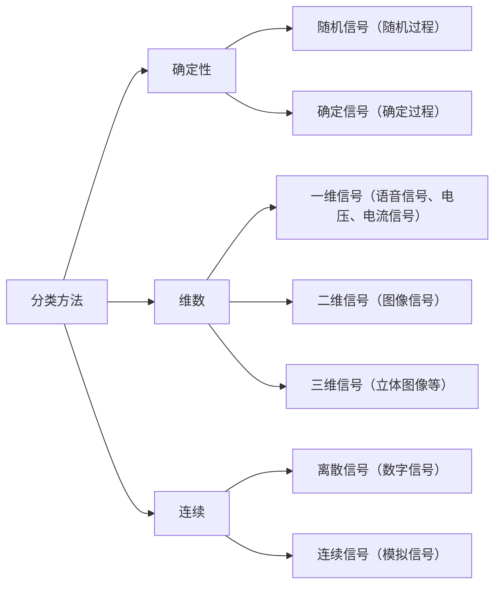

[TOC]

# 绪论

## 前言——为什么要研究数字信号处理

(这段是编者写的，文笔很渣请见谅)

信号处理是计算机科学、通信科学的重要问题，也是人工智能、自动控制等技术的基础，它分为三条主线。

- 基本信号及其响应；
- 信号的分解；
- 线性时（移）不变系统分析。

传统的基于连续系统的信号处理方式存在不足，因此我们需要研究数字信号处理——以离散信号和系统为研究对象

### 数字化的必要性

在数字电子技术、计算机技术成熟之前，信号处理主要依赖连续系统完成相关功能，这点在较为落后的那部分无线电技术中有很明显的体现，但连续系统一般通过模拟电路来实现，信号和系统对客观物理规律的依赖导致对信号进行处理时要考虑的要素很多，而且系统各部分存在耦连（如阻抗匹配），难以模块化，

为了方便CPU和其他数字电路的处理，我们需将信号和系统分别离散化。这样一来，利用软件和软件化的硬件构建系统对离散信号处理就大大提高了设计的效率和灵活性。

### 数字化遇到的问题

从连续到离散的变化对信号处理理论提出了新的要求，包括但不限于：

- 信号不失真采样
- 离散信号恢复为连续信号
- 离散系统的设计

《数字信号处理》这门课程在整个信号处理领域的重要性仅次于《信号与系统》，这门课程提供了一系列高效的信号处理算法，比如FFT（快速傅里叶变换），FIR（有限冲激响应滤波器），IIR（无限冲激响应滤波器）算法乃至于卡尔曼滤波、维纳滤波等现代滤波算法。

这些算法可由软件也可由硬件实现。软件方案具有灵活性，开发效率高，但对硬件的要求较高。硬件方案的优点则为高校、实时，但开发难度大，开发周期长。

目前实现DSP算法的常用平台有：

- 通用处理器
- 嵌入式处理器
- FPGA
- DSP
- GPU
- DPU

以上几种方案各有优劣，此处不再赘述

## 数字信号处理 Digital Signal Processing

教材和教学内容

教材：《数字信号处理教程》程佩青 清华大学出版社

章节：

- 一、离散时间信号与系统

- 二、z变换

- 三、离散傅里叶变换 (DFT)

- 四、快速傅里叶变换 (FFT)

- 五、数字滤波器的基本结构

- 六、无限冲激响应滤波器 (IIR) 设计

- 七、有限冲激响应滤波器 (FIR) 设计

在学科发展上， 数字信号处理又和最优控制， 通信理论， 故障诊断等紧紧相连， 成为人工智能， 模式识别， 神经网络， 数字通信等新兴学科的理论基础。 

### 数字信号处理的特点

与模拟信号处理相比，数字信号处理具有如下特点:

1. 精度高、可获得高性能指标：模拟信号处理的精度很难达到$10^{-3}$，而17bit.  字长的数宇系统的精度可达 $10^{-5}$ 。

2.  灵活性好：数宇信号处理的性能主要决定于乘法器的各系数，且系数存放于系数存储器内，只需改变存储器的系数，就可得到不同的系统，比改变模拟系统方便得多。

3.  时分复用：可同时处理多个数宇通道的信号。

4. 可靠性高、抗干扰能力强：模拟信号处理易受各种干扰。数字信号只有0和1两个电平，受噪声和环境干扰小。 

### 数字信号处理发展历程

+ 1669-Newton偶然发现了光谱，却没有意识到" 频率" 的概念

+ 1807-Fourier分析诞生

+ 19th/20th century-出现了两种Fourier分析方法-Continuous & Discrete（编者注：连续和离散）

+ 1965-IBM's Cooley&Tukey发明了FFT(Fast Fourier Transform) 算法，使FFT得以在计算机平台上快速实现————标志着DSP学科的产生

+ 1978-出现第一块DSP芯片(TI，德州仪器)，主要用于军事

+ 80年代–随看大规模集成电路技术、微电子技术、半导体技术的发展，出现了专用的离散时间信号处理高速定点、浮点计算器，数字产品民用化

+ 90年代至今-DSP技术发展迅速，渗入到人们学习、工作、生活各方各面；同时出现了新的DSP理论和方法，如现代谱分析、小波等

### 信号
- 信号是信息的载体

- 信号的分类

### 系统

系统是对信号进行处理实现某功能的物理设备 
主要功能：
- 信号更清晰
- 提取有用信息

### 数字信号处理系统

数字信号处理系统框图：

- 对连续信号进行等间隔采样时，若不能满足采样定理，采样后信号的频率就会重叠，即高于采样频率一般的频率将被重建成低于采样频率一半的信号，这种频谱的重叠导致的失真成为混叠（Aliasing）
- 量化编码不能瞬时完成，因此抽样保持既要对模拟信号进行抽样（时间离散化）又要将抽样的幅度保持以完成量化编码，量化编码将送入的抽样保持信号的幅度加以量化并形成二进制编码信号（数字信号）

### 数字信号处理器

数字信号处理器：DSP芯片，是一种特别适合于进行数字信号处理运算的微处理器，其主要应用是实时快速地实现各种数字信号处理算法。

根据数宇信号处埋的要求，DSP芯片一般具有如下主要特点

- 在一个指令周期内可穴成一次乘法和一次加法
- 程序和数据空间分开，可以同时访问指令和数据
- 片内具有快速RAM，通常可通过独立的数据总线在两块见同时访问
- 具有低开销或无开销循环及跳转的硬件支持
- 快速的中断处理和硬件I/O支持
- 貝有在单周期内操作的多个硬件地址产生器
- 可以井行执行多个捚作
- 支持流水线操作，使取值、译码和执行等操作可以重叠执行

### 数字信号处理的实现方法

- 采用大、中/型计算机和微机

    工作站和微机上各厂家的数字信号软件，如有各种图象压缩和解压软件

- 用单片机

    根据不同环境配不同单片机，其能达实时控制，但数据运算量不能太大

- 利用通用DSP芯片

    DSP芯片较之单片机有着更为突出优点。如内部带有乘法器，累加器，采用流水线工作方式及并行结构，多总线速度快。配有适于信号处理的指令(如FFT指令)等。 美国德州仪器公司Texas Instrument (TI)，Analog Devices， Lucent， Motorola， AT&T等公司都有生产
    用通用的可编程的数字信号处理器实现法————是目前重要的数字信号处理实现方法，它即有硬件实现法实时的优点，又具有软件实现的灵活性优点。
    

- 利用特殊用途的DSP芯片

    市场上推出专门用于FFT，FIR滤波器，卷积、相关等专用数字芯片。其软件算法已在芯片内部用硬件电路实现，使用者只需给出输入数据，可在输出緛直接得到数据

### 数字信号处理的应用

- 通信：GSM/蜂窝电话， CDMA;

- 语音处理：语音编码、语音合戌、语音识别、语音坦强、语音邮件、语音储存等；

- 图像/图形：二维和三维图形处理、图㑰压缩与传输、图㑰识别、动画、机器人视觉、多媒体、电子地图、图像增强等；

- 军事：保密通信、雷达处理、声呐处理、导航、全球定位、跳频电台、搜索和反搜索等；

- 仪器仪表： 频谱分析、函数发生、数据采集、地震处理等；

- 自动控制：控制、深空作业、自动驾驶、机器人控制、磁盘控制等;

- 医疗：助听、超声设备、诊断工具、病人监护、心电图等；

- 家用电器：数宇音响、数宇电视、可视电话、音乐合成、音调控制、玩具与游戏
