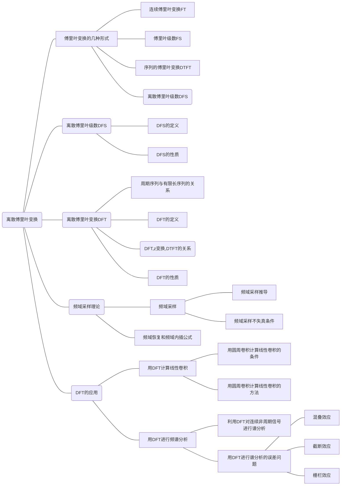

[TOC]

## 频域抽样理论

### 问题引入

由Z变换与DFT的关系

$$
\tilde{X}(k)=\left.X(z)\right|_{z=W_{N}^{-k}}
$$

实现了频域的抽样, 便于计算机计算。但如此产生如下问题：

能否由用频域抽样来恢复原来的信号（或频率函数）? 其限制条件是什 么?

内插公式又是什么? 

###  分析

因为

$$
X(k)=\left.X(z)\right|_{z=W_{N}^{-k}}=\sum_{n=-\infty}^{\infty} x(n) W_{N}^{n k}
$$

抽样后所获得的有限长序列 $x_{N}(n)$ 能否代表原序列 $x(n)$ ?

我们从周期序列 $\tilde{x}_{N}(n)$ 开始:

$$
\begin{aligned}
&\tilde{x}_{N}(n)=\operatorname{IDFS}[\tilde{X}(k)]=\frac{1}{N} \sum_{k=0}^{N-1} \tilde{X}(k) W_{N}^{-n k}=\frac{1}{N} \sum_{k=0}^{N-1} X(k) W_{N}^{-n k} \\
&=\frac{1}{N} \sum_{k=0}^{N-1}\left[\sum_{m=-\infty}^{\infty} x(m) W_{N}^{m k}\right] W_{N}^{-n k}=\sum_{m=-\infty}^{\infty} x(m)\left[\frac{1}{N} \sum_{k=0}^{N-1} W_{N}^{(m-n) k}\right]
\end{aligned}
$$

通过旋转因子的正交性去掉第一个求和号得到
$$
\tilde{x}_{N}(n)=\sum_{r=-\infty}^{\infty} x(n+r N)
$$


即 $\tilde{x}_N(n)$ 是原非周期序列 $x(n)$ 的周期延拓序列，其时域周期为频域抽样点数 $N$ 

在第一章我们看到, 时域抽样造成频域周期延拓；同样, 频域抽样造成时域周期延拓


###  结论

如果 $x(n)$ 是长度为 $M$ 的有限长序列, 频域抽样不失真的条件:

频域抽样点数 $N$ 要大于或等于序列长度 $M$ ，即满足: $N \geq M$ 。

此时可得到：

$$
x_{N}(n)=\tilde{x}_{N}(n) R_{N}(n)=\sum_{r=-\infty}^{\infty} x(n+r N) R_{N}(n)=x(n)
$$

表明: 长度为 $N$ (或小于 $N$ ) 的有限长序列可用它的z变换在单位圆上的 $N$ 个均分点上的采样值精确地表示。

若不满足 $N \geq M$, 则产生时域混叠现象。 

注意:

如果 $x(n)$ 是无限长序列, 则时域周期延拓后, 必然造成混叠现象, 因而一定会产生误差;

当 $n$ 增加时信号衰减得越快, 或频域抽样越密（即抽样点数 $N$ 越大），则误差越小。


### 频域恢复一频域内插公式

从频域抽样不失真条件可以知道

$N$ 个频域抽样值 $X(k)$ 能不失真的还原出长度为 $N$ 的有限长序列} $x(n)$ 。

那么用 $N$ 个 $X(k)$ 也一定能完整地表示出 $X(\mathrm{z})$ 以及频率响应 $\left(\mathrm{e}^{\mathrm{j} \omega}\right)$ [即单位圆上的 $X(z)$ ] 。

过程：先把 $N$ 个 $X(k)$ 作IDFT得到 $x(n)$ ，再把 $x(n)$ 作 $z$ 变换便得到 $X(z)$ 。 

#### 用频域采样 $X(k)$ 表示 $X(z)$ 的内插公式

$M$ 点有限长序列 $x(n)$, 频域 $N$ 点等间隔抽样，且 $N \geq M$ 

$$
\begin{aligned}
X(z) &=\sum_{n=0}^{M-1} x(n) z^{-n}=\sum_{n=0}^{N-1} x(n) z^{-n} \\
&=\sum_{n=0}^{N-1}\left[\frac{1}{N} \sum_{k=0}^{N-1} X(k) W_{N}^{-n k}\right] z^{-n} \\
&=\frac{1}{N} \sum_{k=0}^{N-1} X(k)\left[\sum_{n=0}^{N-1} W_{N}^{-n k} z^{-n}\right] \\
&=\frac{1}{N} \sum_{k=0}^{N-1} X(k) \frac{1-W_{N}^{-N k} z^{-N}}{1-W_{N}^{-k} z^{-1}}=\frac{1-z^{-N}}{N} \sum_{k=0}^{N-1} \frac{X(k)}{1-W_{N}^{-k} z^{-1}}
\end{aligned}
$$

内插公式

$$
X(z)=\frac{1-z^{-N}}{N} \sum_{k=0}^{N-1} \frac{X(k)}{1-W_{N}^{-k} z^{-1}}
$$

内插函数

$$
\Phi_{k}(z)=\frac{1}{N} \cdot \frac{1-z^{-N}}{1-W_{N}^{-k} z^{-1}}=\frac{1}{N} \cdot \frac{\left(z^{N}-1\right)}{z^{N-1}\left(z-W_{N}^{-k}\right)}
$$


则内插公式简化为

$$
X(z)=\sum_{k=0}^{N-1} X(k) \Phi_{k}(z)
$$

内插函数的零点和极点

- 零点 

$$
z=e^{j \frac{2 \pi}{N} r} \quad r=0,1, \ldots, N-1
$$

- 极点

$$
z=\begin{cases}
e^{j \frac{2 \pi}{N} k} &1\text {阶}\\
 0 &(N-1){\text {阶}}
\end{cases}
$$

但 $z=W_{N}^{-k}$ 处发生零极相消，因此只有 $z=0$ 处有 $N-1$ 阶极点，同样 $z=W_{N}^{-k}$ 处的零点也消失了，因此实际上每个 $k$ 对应的内插函数零极点分布如下图所示。


### 用频域采样 $X(k)$ 表示 $X\left(e^{j \omega}\right)$ 的内插公式

$$
X\left(e^{j \omega}\right)=\left.X(z)\right|_{z=e^{j \omega}}=\sum_{k=0}^{N-1} X(k) \Phi_{k}\left(e^{j \omega}\right) \\
\left(e^{j \omega}\right)
=\left.\Phi_{k}(z)\right|_{z=e^{j o}}
=\frac{1}{N} \cdot \dfrac{\sin \left[N\left(\dfrac{\omega}{2}-\dfrac{\pi}{N} k\right)\right]}{\sin \left(\dfrac{\omega}{2}-\dfrac{\pi}{N} k\right)} e^{-j \frac{N-1}{2} \omega} e^{j \frac{k \pi}{N}(N-1)}
$$

内插函数 :

$$
\Phi(\omega)=\frac{1}{N} \cdot \frac{\sin \left(\frac{\omega N}{2}\right)}{\sin \left(\frac{\omega}{2}\right)} e^{-j\left(\frac{N-1}{2}\right) \omega}
$$

图像如下图所示


可以看出, 当 $\omega=0$ 时, $\Phi(\omega)=1$

当 $\omega=(2 \pi / N) i(i=1,2, \ldots N-1)$ 时, $\Phi(\omega)=0$ 因而有

$$
\Phi\left(\omega-\frac{2 \pi}{N} k\right)=\left\{\begin{array}{cc}
1, & \omega=\frac{2 \pi}{N} k \\
0, & \omega=\frac{2 \pi}{N} i, i \neq k
\end{array}\right.
$$

内插公式：

$$
X\left(e^{j \omega}\right)=\sum_{k=0}^{N-1} X(k) \Phi\left(\omega-\frac{2 \pi}{N} k\right)
$$

在每个抽样点上 $X\left(\mathrm{e}^{\mathrm{j} \omega}\right)$ 精确地等于 $X(k)$ (因为其他的内插函数在这一点上的值为零,无影响);


各抽样点之间的 $X(e^{j\omega})$ 值，则由各抽样点的加权内插函数在所求点上的值叠加而得到。


### 频域与时域抽样恢复的比较

|              | 时域角度           | 频域角度         |
| ------------ | ------------------ | ---------------- |
| 时域采样恢复 | 内插               | 加低通，频域截断 |
| 频域采样恢复 | 加矩形窗，时域截断 | 内插             |


## 用DFT对模拟信号作频谱分析

### 信号的频谱分析：计算信号的傅里叶变换


设:对连续非周期信号进行时域抽样, 采样间隔为 $T$ (时域);对其连续非周期性的频谱函数进行频域采样, 频域采样间隔为 $F_{0}$ (频域);

时域采样, 频域周期延拓,即频域周期 $f_s=1 / T$;频域采样，时域周期延拓，即时域周期 $T_{0}=1 / F_{0}$ 

必须对时域与频域做截断， 若时域取 $N$ 点，则频域至少也要取 $N$ 点 

### 离散傅里叶变换对中各参量间的关系


$T_{0}$ ：时域长度

$T$ : 时域量相邻抽样点的时间间距

$f_{s}$ : 时域抽样频率

$F_{0}$： 频域两相邻抽样点的频率间距，且 $F_{0}=\Omega_{0} / 2 \pi$

$N$ : 在 $\mathrm{T}_{0}$ 时间段中抽样点数

$$
\begin{aligned}
&T_{0}=N T=\frac{N}{f_{s}}=\frac{1}{F_{0}} \\
&F_{0}=\frac{f_{s}}{N}=\frac{1}{N T}=\frac{1}{T_{0}}
\end{aligned}
$$

时域采样间隔 $T$ 等于抽样频率 $f_{s}$ 的倒数 $\left(T=1 / f_{s}\right)$

频域采样间隔 $F_{0}$ 等于时域的时间长度 $T_{0}$ 的倒数 $\left(F_{0}=1 / T_{0}\right)$

$F_{0}$ 等于抽样频率 $f_{s}$ 与抽样点数 $N$ 的比值 $\left(F_{0}=f_s / N\right)$ 

$T-$ 时域采样间隔

$f_{s}-$ 时域采样频率

$T_{0}-$ 信号记录长度

$F_{0}-$ （频率分辨率）频域采样间隔

$N-$ 采样点数

$f_{h}-$ 信号最高频率

### 频率轴定标


### 用DFT对模拟信号作频谱分析的步骤

对模拟信号进行谱分析要基于模拟信号的傅里叶变换
$$
\begin{aligned}
&X(\mathrm{j} \Omega)=\int_{-\infty}^{\infty} x(t) \mathrm{e}^{-\mathrm{j} \Omega t} \mathrm{~d} t \\
&x(t)=\frac{1}{2 \pi} \int_{-\infty}^{\infty} X(\mathrm{j} \Omega) \mathrm{e}^{\mathrm{j} \Omega t} \mathrm{~d} \Omega
\end{aligned}
$$


#### 时域抽样与截断

- 时域抽样

$$
x(n)=x_{a}(n T)=\left.x(t)\right|_{t=n T} \\
$$

为保证频域不混迭必须满足 $T\leq \frac{1}{2f_h}$ 

- 时域截断

$t=0 \sim T_{0}$ ，包含 $N$ 个抽样点

$$
X(j \Omega) \approx T \sum_{n=0}^{\mathrm{N}-1} x(n T) e^{-j \Omega n T}  \\
X(j f) \approx T \sum_{n=0}^{\mathrm{N}-1} x(n T) e^{-j 2 \pi f n T} 
$$

$X(jf)$ 仍是 $f$ 的连续周期函数

(编者注：注意这里和DTFT差一个因子 $T$ ，保留了采样频率这一信息，这里因为输入和输出都是模拟信号而采用了一种快捷的算法）

#### 频域抽样与截断

对 $X(j f)$ 在 $(0, f s)$ 上等间隔采样 $\mathrm{N}$ 点, 抽样间隔为 $F_{0}$


$$
X\left(j k F_{0}\right)=\left.X(j f)\right|_{f=k F_{0}}=T \sum_{n=0}^{N-1} x_{a}(n T) e^{-j \frac{2 \pi}{N} n k} \\
X_{a}(k)=T \sum_{n=0}^{N-1} x(n) e^{-j \frac{2 \pi}{N} n k}=T \cdot \mathrm{D} \mathrm{FT}[x(n)]
$$

同理,由

$$
x_{a}(t)=\int_{-\infty}^{\infty} X(j f) e^{j 2 \pi f t} d f
$$

可以推出:

$$
x(n)=x_{a}(n T) =F_{0} \sum_{k=0}^{N-1} X_{a}(k) e^{j \frac{2 \pi}{N} k n}=F_{0} N\left[\frac{1}{N} \sum_{k=0}^{N-1} X_{a}(k) e^{j \frac{2 \pi}{N} k n}\right] 
=\frac{1}{T} \operatorname{IDFT}\left[X_{a}(k)\right]
$$

#### 结论

连续非周期信号的频谱可以通过对连续信号采样后进行DFT并乘以系数 $T$ 的方法来近似得到, 而对该DFT值做反变换并除以系数 $T$ 就得到时域采样信号。


## 用DFT进行谱分析的误差问题

DFT逼近连续非周期信号的傅里叶变换过程中除了对幅度的线性加权外, 由于用到了采样与截断的方法, 因此, 也会带来一些可能产生的问题, 使谱分析产生误差。如：混叠效应、截断效应、栅栏效应等。


### 混叠效应

不满足抽样定理时, 便会产生混叠失真。

$$
f_{s} \geq 2 f_{h}
$$

但此条件只规定出 $f_{\mathrm{s}}$ 的下限为 $2 f_{h}$ ，其上限要受抽样间隔 $F_{0}$ 的约束。


#### 频谱分析宽度与频率分辨率

采样间隔 $F_{0}$ （频率分辨率）是记录长度的倒数, 即

$$
F_{0}=\frac{1}{T_{0}}
$$

若采样点数为 $N$, 则频率分辨率 $F_{0}$ 与 $f_{s}$ 的关系为

$$
F_{0}=\frac{f_{s}}{N} \geq 2 \frac{f_{h}}{N}
$$

在 $N$ 给定时, 为避免混叠失真而一味提高采样频率, 必然导致 $F_{0}$ 增加, 即频率分辨率下降;（编者注：时域上看就是采样时间短了）

反之, 若要提高频率分辨率即减小 $F_{0}$, 则导致减小 $f_{s}$, 最终必须减小能分析的信号带宽。

在 $f_{s}$ 与 $F_{0}$ 参数中, 保持其中一个不变而使另一个性能得以提高的唯一办法, 就是增加记录长度内的点数 $N$ 。 

### 载断效应 (时域加窗)

在实际中，要把观测的信号 $x(n)$ 限制在一定的时间间隔之内，即采取截断数据的过程;

时域的截断在数学上的意义为原连续时间信号乘上一个窗函数 （通常, 简单的截取信号就相当于乘的是矩形窗）。

根据傅里叶变换的卷积定理, 信号加窗后的频谱相当于原信号频谱与窗函数的频谱在频域作卷积。显然, 这种卷积过程将造成信号频谱的失真。

失真频谱将产生 “拖尾"（频谱延伸扩展）现象一一 原有受限的频谱图形“扩展” 开来，这就称之为**频谱泄漏**。

#### 频谱展宽

截断后, 使原来的离散谱线向附近展宽, 即：频谱 “泄露"到其"它频率处;

#### 频谱拖尾

主谱线两端形成的许多旁瓣，引起不同频率分量间的干扰。

注意： 泄露和谱间干扰使频谱展宽和拖尾, 也会造成频谱的混叠失真。


#### 截断效应演示实验

-  实验代码

```matlab
%===常数===
w0=0.05*pi;
w1=0.07*pi;
A0=1;
A1=2;
N=1024;
n=0:N-1;
WinL=50;
w=linspace(-1,1,N);
%===时域===
win=[ones(1,WinL),zeros(1,N-WinL)];
xn=A0*cos(w0*n)+A1*cos(w1*n);
yn=win.*xn;
%===频域===
Xe=abs(fftshift(fft(xn)));
Xwin=abs(fftshift(fft(win)));
Ye=abs(fftshift(fft(yn)));
%===绘图===
subplot(3, 2, 1)
plot(n,xn)
title('原信号时域')
xlabel('n')

subplot(3, 2, 2)
plot(w,Xe)
title('原信号频域')
xlabel('w')

subplot(3, 2, 3)
plot(n,win)
title('窗函数时域')
xlabel('n')

subplot(3, 2, 4)
plot(w,Xwin)
title('窗函数频域')
xlabel('w')

subplot(3, 2, 5)
plot(n,yn)
title('加窗后信号时域')
xlabel('n')

subplot(3, 2, 6)
plot(w,Ye)
title('加窗后信号频域')
xlabel('w')
```

- 实验结果


- 实验分析

输入信号：
$$
x[n]= A_{0} \cos \left(\omega_{0} n\right)+A_{1} \cos \left(\omega_{1} n\right) \\
X\left(e^{j \omega}\right)= A_{0} \pi \delta\left(\omega+\omega_{0}\right)+A_{0} \pi \delta\left(\omega-\omega_{0}\right) +A_{1} \pi \delta\left(\omega+\omega_{1}\right)+A_{1} \pi \delta\left(\omega-\omega_{1}\right)
$$
理论上讲，$X\left(e^{j \omega}\right)$ 应为四条单位单位抽样序列谱线，但由于MATLAB中自带的快速傅里叶变换函数fft将xn中没有定义的部分当作0，因此实际上的谱线也出现了频谱泄露（但因为取了1024点，频谱泄露不算严重）。

窗函数：
$$
w[n]=\begin{cases}
1&0 \leq n \leq 50\\
0&else
\end{cases}\\
 \\
 \\
\begin{aligned}
W\left(e^{j \omega}\right) &=\sum_{n=0}^{L-1} \mathrm{e}^{-\mathrm{j} \omega n}=\frac{1-e^{-j \omega L}}{1-e^{-j \omega}} \\
=& \frac{e^{-j \omega L / 2} 2 j \frac{1}{2 j}\left(e^{j \omega L / 2}-e^{-j \omega L / 2}\right)}{e^{-j \omega / 2} 2 j \frac{1}{2 j}\left(e^{j \omega / 2}-e^{-j \omega / 2}\right)} \\
=& e^{-j \omega(L-1) / 2}\cdot \frac{\sin (\omega L / 2)}{\sin (\omega / 2)}
\end{aligned}
 \\
 
 |W\left(e^{j \omega}\right)|=\left|\frac{\sin (\omega L / 2)}{\sin (\omega / 2)}\right|
$$
加窗后信号：
$$
y[n]=x[n]\cdot w[n]\\
Y\left(e^{j \omega}\right)=\frac{1}{2\pi}X\left(e^{j \omega}\right)*X\left(e^{j \omega}\right)
$$
这里 $\omega_0$ 和$\omega_1$ 取得太接近，因此看不出来四个峰值，但频谱泄露是很明显的。

#### 减小截断效应的方法

1. 采用缓变型的窗函数。即选择适当形状的各种缓变的窗函数, 例如升余弦窗（汉宁窗或海明窗）等, 使得窗谱的旁瓣能量更小，卷积后造成的频谱泄露减小。

2. 加大窗宽 ${N}$ (即有效数据长度加长)，使主瓣更窄, 漏泄可以降低。 

### 栅栏效应

序列 $x(n)$ 的频谱是连续的, 而DFT是这个连续谱的均匀抽样。

如果用 $X(k)$ 去近似, 就一定意义上来讲, 好象是在栅栏的一边通过栅栏的缝隙（对应离散点）去观看另一边的景象（对应连续频 谱）, 只能在离散点的地方看到真实的景象。

因此, 那些被栅栏挡住的（频谱）部分是看不到的, 这就有可能漏掉一些较大频率分量。这种现象称为“栅栏效应”。 


序列后补零, 可以观察到频谱中的更多细节 

减小“栅栏效应”的一个方法就是要使频域抽样更密, 即 增加频域抽样点数, 在不改变时域数据的情况下, 必然是在时域数据末端增补若干个零值, 借以改变原序列的长度, 但并不改变原有的记录数据。

补零的好处:

1) 补零可以对补零前的DFT频谱做插值, 从而克服栅栏效应, 使频谱的外观更加光滑;

2) 使数据 $N$ 为 2 的整数次幂, 以便于用快速傅里叶变换算法 (FFT)。 

## 小结：

(1)误差产生的原因

利用DFT对连续非周期信号进行谱分析时, 时域与频域都要做 抽样和截断, 会带来一些可能产生的问题, 使谱分析产生误差。

(2) 三种误差效应

混叠效应, 截断效应, 栅栏效应。


## 用DFT进行谱分析的参数考虑

### 频率分辩率

#### DTFT的频率分辨率一一物理分辨率

$$
F_{0}=\frac{f_{s}}{N}=\frac{1}{N T}=\frac{1}{T_{0}}
$$

$$
F_{0}=1 / T_{0}
$$

根据离散序列求其连续谱时, 两个谐波分量之间最小可分辨的频率间隔

#### DFT的频率分辨率一一计算分辨率

DFT对DTFT频谱的采样间隔

$$
F_{0}=f_{s} / N
$$


补零提高了计算分辨率, 得到的是高密度频谱;

增加数据的记录长度, 提高了物理分辨率, 得到的是高分辨率谱。 


### 用DFT参数选择的一般原则

1. 确定信号的最高频率 $f_{h}$ 后, 为防止混叠, 采样频率

$$
f_{s} \geq(3-6) f_{h}
$$

2. 根据实际需要, 即根据频谱的 “计算分辨率” 确定频率采样两点之间 的间隔 $F_{0}, F_{0}$ 越小频谱越密，计算量也越大;

3.  $F_{0}$ 确定后, 就可确定做DFT所需的点数, 即

$$
N=\frac{f_{s}}{F_{0}}
$$

为了使用基2-FFT算法, 一般取 $N=2^{M}$ 。

4.  $f_s$ 和 $N$ 确定后, 则可确定所需的数据长度, 即

$$
T_{0}=\frac{N}{f_{s}}=N T
$$


# 第三章 知识图谱




