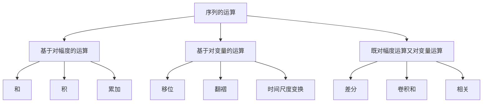

[toc]

# 离散时间信号————序列

序列：对模拟信号$x_{a}(t)$进行等间隔采样, 采样间隔为$T$, 得到

$$
\left.x_{a}(t)\right|_{t=n T}=x_{a}(n T) \quad-\infty<n<\infty
$$

$n$取整数。对于不同的$n$值,$x_{a}(n T)$是一个有序的数字序列

$$
\ldots x_{a}(-T), x_{a}(0), x_{a}(T), x_{a}(2 T), \ldots
$$

该数字序列就是离散时间信号。

离散时间信号的处理有时在严格意义上，是非实时的, 可以先记录数据后分析或存放在存储器中以供随时取用，因此$x(n T)$可以看做是按照一定顺序排列的一组数据，这些数字序列值按顺序存放存储器中，此时$nT$代表的是前后顺序。

现在，我们只关心$n$，则将$x_a(nT)$简写成如下形式
$$
x(n)
$$

## 序列的定义

$$
\left.x_{a}(t)\right|_{t=n T}=x_{a}(n T) \quad-\infty<n<\infty
$$

- $x(n)$代表第$n$个序列值, 在数值上等于信号的采样值

- $x(n)$只在$n$为整数时才有意义

- $n$不是整数时没有定义. 但不能认为$x(n)$的值为零

通常如下表示:
$$
\begin{aligned}
x(n)=\{\ldots, 3,2,1,1.5,1,&~2,3,4,0, \ldots\}\\
&\uparrow\\
n&=0
\end{aligned}
$$
离散时间信号的图形表示

## 序列的运算

### 移位

序列$x(n)$， 当$m>0$时

- 延时/右移m位

$$
x'(n)=x(n-m)
$$

- 超前/左移m位

$$
x'(n)=x(n+m)
$$

### 翻褶(转置)

$$
x'(n)=x(-n)
$$

$x(-n)$是以$n=0$的纵轴为对称轴将序列$x(n)$加以翻褶

### 和

$$
x'(n)=x_{1}(n) + x_{2}(n)
$$

同序号$n$的序列值逐项对应相加

### 积（调制）

$$
x'(n)=x_{1}(n) \cdot x_{2}(n)
$$

同序号n的序列值逐项对应相乘

### 累加

$$
x'(n)=\sum_{k=-\infty}^{n} x(k)
$$

即序列$x'(n)$在任一点的值为$x(n)$在该点的值与该点之前所有点的值之和

### 差分

- 前向差分

$$
\Delta x(n)=x(n+1)-x(n)\\
$$

- 后向差分

$$
\nabla x(n)=x(n)-x(n-1)\\
$$

有如下关系：

$$
\Delta x(n)=\nabla x(n+1)\\
\nabla x(n)=\Delta x(n-1)
$$

### 时间尺度变换

- 抽取
  
$$
x'(n)=x(m n)=\left.x_{a}(t)\right|_{t=m n T}
$$

其中$x(n)=\left.x_{a}(t)\right|_{t=n T}$
抽取运算不是简单在时间轴上按比例增加到$m$倍，而是以$1/m$倍的取样频率每隔$m-1$个点抽取1点，保留$x(0)$

  

  - 插值

$$
  x'(n)=x\left(\frac{n}{m}\right)
$$

  

### 卷积和

设两序列$x(n)$和$h(n)$，则其卷积和$y(n)$定义为：

$$
y(n)=\sum_{m=-\infty}^{\infty} x(m) h(n-m)=x(n) * h(n)
$$

可认为是以下四个步骤的组合：

- 翻褶

$$
\quad x(n) \rightarrow x(m) \\
h(n) \rightarrow h(m) \rightarrow h(-m)
$$

- 移位

$$
h(-m) \rightarrow h(n-m) \quad
-\infty<n<\infty
$$

- 相乘

$$
x(m) \cdot h(n-m) \quad -\infty<m<\infty , -\infty<n<\infty
$$

- 相加
  
$$
\sum_{m=-\infty}^{\infty} x(m) h(n-m) \quad -\infty<n<\infty
$$

### 相关(correlation)

- 互相关

$$
r_{x y}(n)=\sum_{m=-\infty}^{\infty} x(m) y(m+n)
$$
- 自相关

$$
r_{x }(n)=\sum_{m=-\infty}^{\infty} x(m) x(m+n)
$$

相关与线性卷积的关系:

$$
r_{x y}(m)=x(-m)^{*} y(m) \\
r_{x}(m)=x(-m)^{*} x(m)
$$

## 几种典型序列

### 单位抽样序列

$$
\delta(n)= \begin{cases}1 & n=0 \\ 0 & n \neq 0\end{cases}
$$

### 单位阶跃序列

$$
u(n)= \begin{cases}1 & n \geq 0 \\ 0 & n<0\end{cases}
$$

与单位抽样序列的关系

$$
u(n) =\sum_{m-0}^{\infty} \delta(n-m)=\sum_{k=-\infty}^{n} \delta(k)\\
\delta(n)=u(n)-u(n-1) \\
$$

### 矩形序列

$$
R_{N}(n)=\left\{\begin{array}{cc}
1 & 0 \leq n \leq N-1 \\
0 & 其 它  n
\end{array}\right.
$$

与其他序列的关系

$$
R_{N}(n)=u(n)-u(n-N) \\
R_{N}(n)=\sum_{m=0}^{N-1} \delta(n-m)
$$

### 实指数序列

$$
x(n)=a^{n} u(n) \quad a \in R
$$

### 复指数序列

$$
x(n) =e^{\left(\sigma+j \omega_{0}\right) n}=e^{\sigma n} \cdot e^{j \omega_{0} n} =e^{\sigma n} \cos \left(\omega_{0} n\right)+j e^{\sigma n} \sin \left(\omega_{0} n\right)
$$

$\omega_{0}$为数字域频率

例：

$$
x(n)=0.9^{n} e^{j \frac{\pi}{3} n}
$$

### 任意序列

任意序列均可分解为不同延迟单位脉冲序列的线性组合
$$
x(n)=\sum_{k=-\infty}^{\infty} x(k) \delta(n-k)
$$

由卷积的定义：
$$
x(n)=\sum_{k=-\infty}^{\infty} x(k) \delta(n-k)=x(n)*\delta(n)
$$

## 序列的周期性

若对所有$n$存在一个最小的正整数$N$，满足

$$
x(n)=x(n+N) \quad-\infty<n<\infty
$$

则称序列$x(n)$是周期性序列，周期为$N$。

### 数字角频率$\omega_0$的定义

设有周期为$T_0$的连续正弦信号

$$
x(t)=A \sin \left(\Omega_{0} t+\phi\right)
$$

进行抽样，周期为$T_s$

$$
x(n)=\left.x(t)\right|_{t=n T_s}=A \sin \left(\Omega_{0} n T_s+\phi\right)=A \sin \left(\omega_0 n+\phi\right)
$$
将$n$看作自变量，$\Omega$、$T_s$看作参变量，可以定义
$$
\omega_0=\Omega_0 T_s
$$
这时我们发现，$\omega_0$的量纲为1。

我们称$\omega_0$为数字角频率，这样我们就得到了数字角频率的定义。

由于设备一般给出的是频率，因此常用下面的式子求出$\omega_0$：
$$
\omega_0=2\pi\frac{f_0}{f_s} \\
$$

### 数字角频率$\omega_0$对周期性及周期的影响

现有序列
$$
x(n)=A \sin \left(\omega_0 n+\phi\right)
$$
要使$x(n)$为周期为$N$的周期序列则要求
$$
x(n)=x(n+N)=A \sin \left(\omega_0 n+\omega_0 N+\phi\right)\\
\omega_{0} N=2 \pi m\\
$$
即
$$
\frac{2\pi}{\omega_0}=\frac{N}{m}
$$
其中，$N, m$为整数，且$m$的取值保证$N$是最小的正整数。（编者注：通常说$\frac{2 \pi}{\omega_0}$为有理数）

这时周期$T$有
$$
T=mN
$$
特别地，当$m=1$时$N$为最小正周期。

### 采样周期$T$和原本模拟信号周期$T_0$对周期性的影响

设有周期为$T_0$的连续正弦信号

$$
x(t)=A \sin \left(\Omega_{0} t+\phi\right)
$$

进行抽样，周期为$T$

$$
x(n)=\left.x(t)\right|_{t=n T}=A \sin \left(\Omega_{0} n T+\phi\right)=A \sin \left(\omega n+\phi\right)
$$
将$n$看作自变量，$\Omega$、$T$看作参变量，可以定义
$$
\omega=\Omega_0T
$$
这时我们发现，$\omega$的量纲为1。

我们称$\omega$为数字角频率，这样我们就得到了数字角频率的定义。

由于设备一般给出的是频率，因此常用下面的式子求出$\omega$：
$$
\omega=2\pi\frac{f_0}{f_s} \\
$$
其中
$$
 \omega_{0}=\Omega_{0} T=2 \pi f_{0} T=2 \pi \frac{T}{T_{0}}
$$
（第一个等式也是数字角频率$\omega$的定义）

则
$$
\frac{2 \pi}{\omega_{0}}=\frac{N}{m}=\frac{T_{0}}{T}
$$

故$\frac{T_0}{T}$为整数或有理数时,$x(n)$为周期序列。 

即
$$
N T=mT_{0}
$$
结论：$N$个抽样间隔应等于$m$个连续正弦信号周期，若不满足，即使是连续信号是周期的，采样后得到的序列也不是周期的）

## 序列的能量

设序列为$x(n)$, 则

$$
E=\sum_{n=-\infty}^{\infty}|x(n)|^{2}
$$

定义为序列的能量, 表示序列各取样值的平方之和；
若为复序列, 取模值后再求平方和。